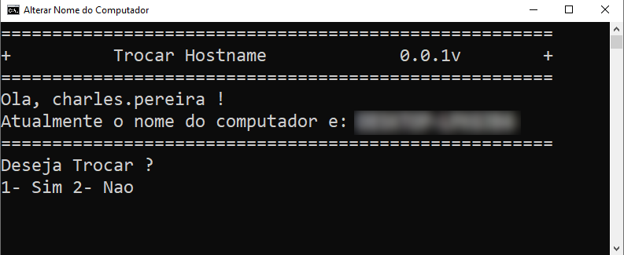
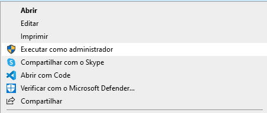

# Scripts Pós Instalação Windows 10/11 x86_64


## Sobre

Esses scripts tem por finalidade, automatizar, o processo de Pós Instalação, no momento está em faze *beta*, então verifique o **código**, antes de executar.

## Dependências

* [Winget][def]
* Windows Update (Windows deve estar atualizado)

## Obtendo os Scripts

Baixe o código usando o git clone:

```cmd
git clone https://github.com/selrahcsan/ScriptsPosInstacaoWindows
```

## Instalação Programas Padrão - Programas Padrao.bat

Script de automação de instalção de programas, usando o winget no moodo silencioso.

## ***Atenção***

Esse Script, não precisa de poderes de administrador

### Instalação de x84

Procurando mais programas x86 para adicionar ao script.

Inclui os seguintes programas:

* Adobe Acrobat.Reader
* K-LiteCodecPack.Full

### Instalação de x64

Inclui os seguintes programas:

* Oracle Java 8
* Mozilla Firefox
* Google Chrome
* Adobe Acrobat Reader.64-bit
* WinRAR
* K-LiteCodecPack Full

## Alterar Nome do Computador -AlterarNomeComputador.bat



Script para facilitar a troca de nome do Hostname, caso seja necessário.

## ***Atenção***

Execute esse script com poderes de **Administrador**



[def]: https://www.microsoft.com/p/app-installer/9nblggh4nns1#activetab=pivot:overviewtab
