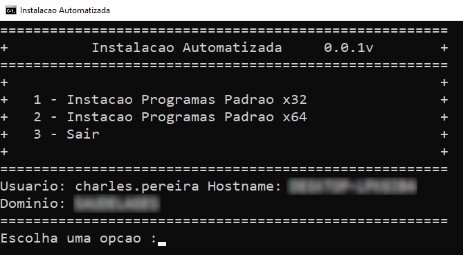

# Scripts Pós Instalação Windows 10/11 x86_64



## Dependências

* [Winget][def]

## Obtendo o Script

Baixe o código usando o git clone:

```cmd
git clone https://github.com/selrahcsan/ScriptsPosInstacaoWindows
```

## Executando o Script

Execute o arquivo ProgramasPadrao.bat e escolha a opção que melhor, lhe atente.

[def]: https://www.microsoft.com/p/app-installer/9nblggh4nns1#activetab=pivot:overviewtab
